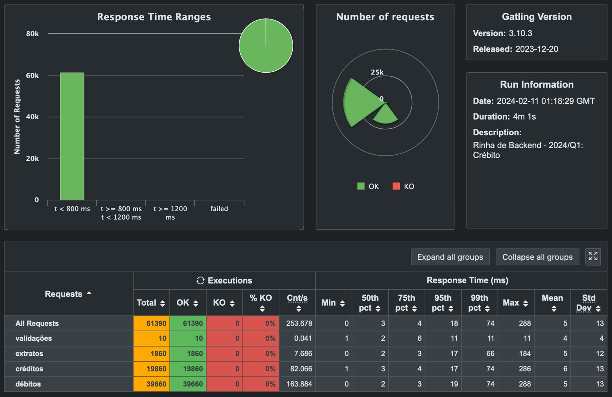

# Rinha de Backend 2024 Q1

- [Repository link](https://github.com/buemura/rinha-de-backend-2024-q1-go-echo)

## Tech Stack

- Go
- echo
- pgx
- PostgreSQL
- NGINX
- Docker

## How to run

- Run: **(Requires Docker and docker-compose)**

```bash
sh scripts/env_up.sh
```

## Author

<div>
  <a href="https://www.linkedin.com/in/bruno-uemura/"></a>
  <a href="https://github.com/buemura/"></a>
</div>

## Result


